# Test

## remark-draw

### dot

Examples taken from the [DOT pocket reference](http://graphs.grevian.org/example)

#### Example 1: Simple Graph

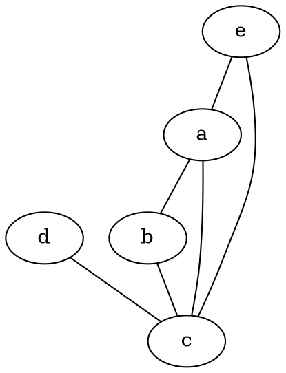

#### Example 2: K6

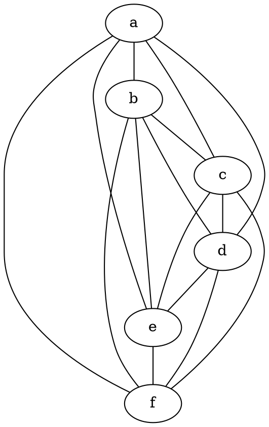

#### Example 3: Simple Digraph

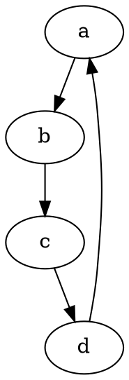

#### Example 4: Full Digraph

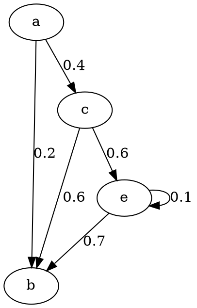

#### Example 5: Showing A Path

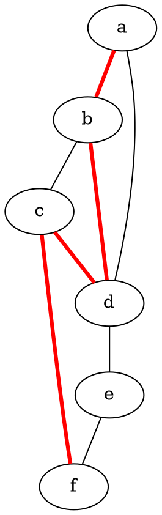

**Note that there's also a shorthand method as follows:**

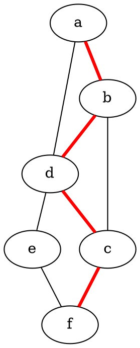

#### Example 6: Subgraphs

Please note there are some quirks here, First the name of the subgraphs are important, to be visually separated they must be prefixed with cluster_ as shown below, and second only the DOT and FDP layout methods seem to support subgraphs (See the graph generation page for more information on the layout methods)

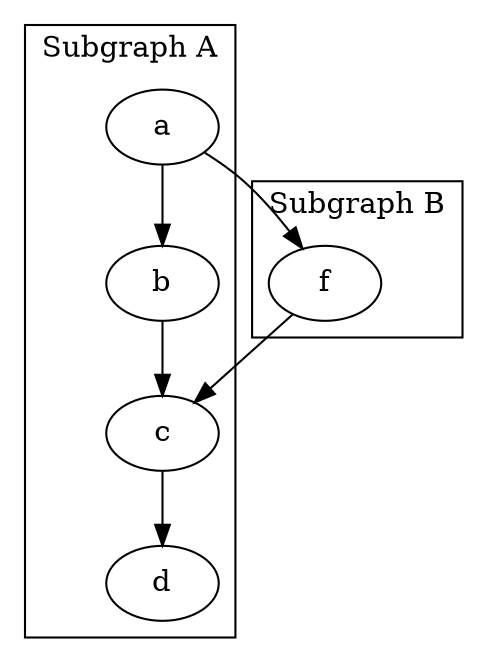

Another Example of a Subgraph, In this example I group nodes together seperately from their edges, And also uses the graph attribute splines=line; to specify that edges should be drawn only as straight lines, no curves allowed.

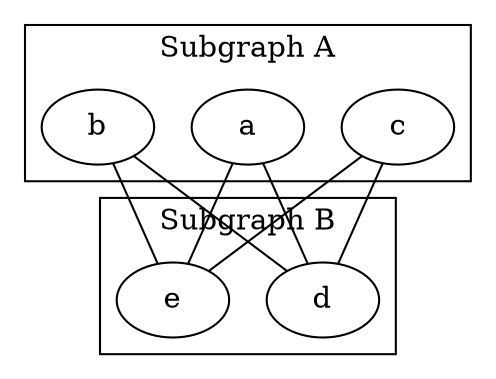

#### Example 7: Large Graphs

To make it easier to input large graph descriptions, One may group edges together with a set of braces, It may also help to lay the graph out left to right instead of top to bottom.

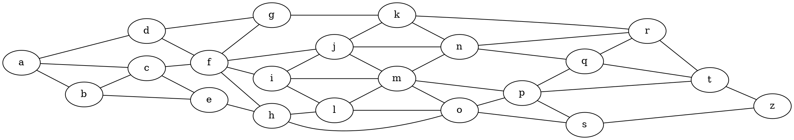

Another feature that can make large graphs manageable is to group nodes together at the same rank, the graph above for example is copied from a specific assignment, but doesn't look the same because of how the nodes are shifted around to fit in a more space optimal, but less visually simple way. We can make it look much more similar by grouping the nodes together for display as is done in the assignment with rank, as follows

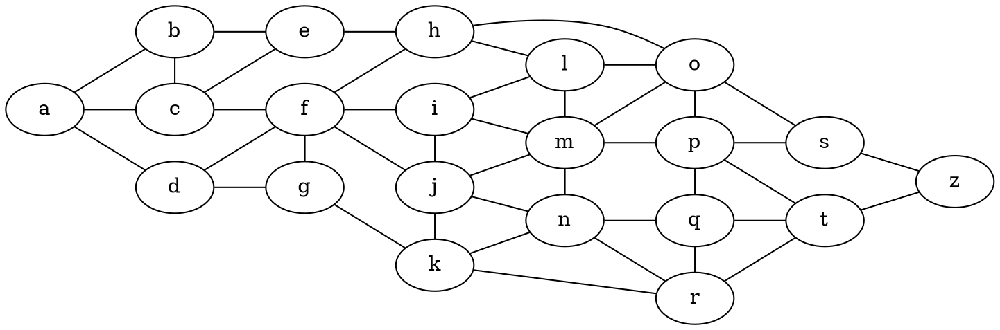

### mermaid

#### Gantt

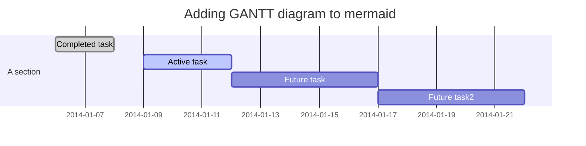

#### sequenceDiagram

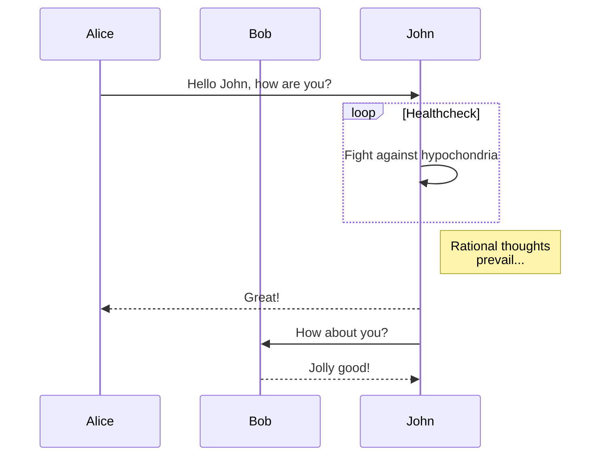

#### classDiagram

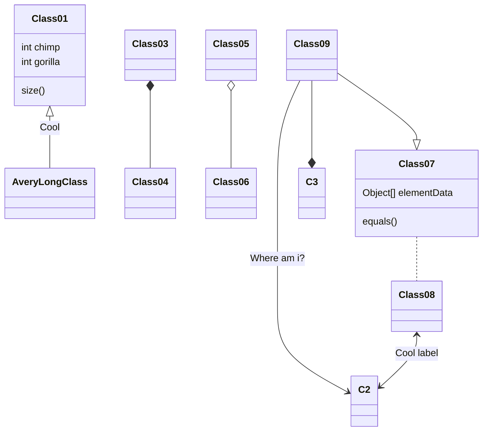

#### gitGraph


## remark-flowchart

```flowchart
st=>start: Start:>http://www.google.com[blank]
e=>end:>http://www.google.com
op1=>operation: My Operation
sub1=>subroutine: My Subroutine
cond=>condition: Yes
or No?:>http://www.google.com
io=>inputoutput: catch something...

st->op1->cond
cond(yes)->io->e
cond(no)->sub1(right)->op1
```

## END
