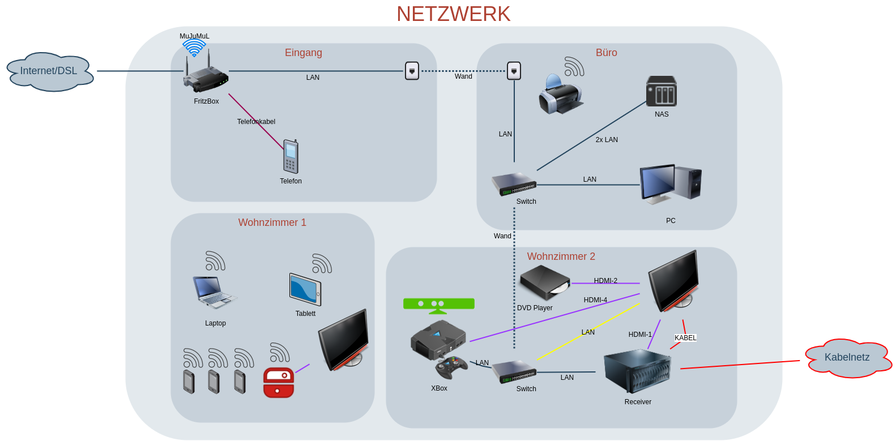

# LG TV 2020

Einstellungen fürs TV

Anschlüsse:

```yaml
HDMI-1: Set Top Box, Kabelreceiver
HDMI-2: DVD Player
HDMI-3: -
HDMI-4: Spielkonsole

LAN: Angeschlossen am Switch zum Router

BNC: Kabel signal durch die Set Top Box kopiert
```



## CEC

Steuert das automatischen ein und ausschalten wenn man einen anderen Gerät ein oder ausshaltet.

```yaml
Einstellungen
- Alle Einstellungen
  - Anschluss
    - Einstellungen der Geräteverbindung
      - SIMPLINK (HDMI-CEC): EIN
```

## Overscan

Sorgt dafür dass nichts von den Quelldaten abgeschnitten wird

```yaml
Einstellungen
- Alle Einstellungen
  - Bild
    - Einstellungen des Seitenverhältnisses
      - Format: ORIGINAL
      - Just scan: EIN
```

Kann von der Set Top Box so getestet werden:

OpenATV:

```yaml
Menü
- Einstellungen
  - Bedienung & Oberfläche
    - Erweitertes GUI
      - OSD Kalibrieren
```

Den roten Rand (aüßeren Bildrand) sollte auf dem TV Schirm sichbar sein. Sind nur Gelb oder Grüne Ränder sichbar, fehlt ein Teil des Bildes.

## WiFi

Da das TV per LAN Kabel verbunden ist, ist Wifi (und verbundene Strahlung/Stromverbrauch) unnötig:

```yaml
Einstellungen
- Alle Einstellungen
  - Anschluss
    - Einstellungen der Netzwerkverbindung
      - Wi-Fi-Verbindung: AUS
```

## Software Update

2020-10-30: update von version 03.10.44 auf 03.11.25

```yaml
Einstellungen
- Alle Einstellungen
  - Support
    - Software Update
      - 03.11.25
```
