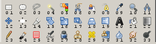

# GIMP

## Gimp toolbox

 They are customizable in the Edit -> Keyboard Shortcuts menu

The default shortcuts are presented here (From version 2.6)

 | **NR** | **Key**                    | **Name**                  | **Type**  | **Default**         | **Ctrl**              | **Shift**            | **Alt**        |
 | ------ | -------------------------- | ------------------------- | --------- | ------------------- | --------------------- | -------------------- | -------------- |
 | 01     | <hk keys="R"></hk>         | Rectangular selection     | Selection | Rectangle           | Center                | Square               |                |
 | 02     | <hk keys="E"></hk>         | Elliptical selection      | Selection | Ellipse             | Center                | Circle               |                |
 | 03     | <hk keys="F"></hk>         | Free/hand drawn selection | Lines     | Selection           | Constrains angle      |                      |                |
 | 04     | <hk keys="U"></hk>         | Fuzzy selection           | Selection |                     |                       |                      |                |
 | 05     | <hk keys="Shift + O"></hk> | Select by color           | Selection |                     |                       |                      |                |
 | 06     | <hk keys="I"></hk>         | Edge fitting selection    | Selection |                     |                       | Disable auto-snap    |                |
 | 07     |                            | Foreground selection      | Selection |                     |                       |                      |                |
 | 08     | <hk keys="B"></hk>         | Create or edit paths      | Path      | Edit                |                       |                      | Move           |
 | 09     | <hk keys="O"></hk>         | Color picker              | Color     | Foreground          | Background            | Info window          |                |
 | 10     | <hk keys="Z"></hk>         | Zoom                      | Zoom      | Zoom in             | Zoom out              |                      |                |
 | 11     | <hk keys="Shift + M"></hk> | Measure                   | Measure   |                     | Horizontal guide      |                      | Vertical guide |
 | 12     | <hk keys="M"></hk>         | Move                      | Position  | Pick and move       | Constrains angle      | Move active layer    |                |
 | 13     | <hk keys="Q"></hk>         | Align                     | Position  |                     |                       |                      |                |
 | 14     | <hk keys="Shift + C"></hk> | Crop                      | Transform | Rectangle           | Center                | Square               |                |
 | 15     | <hk keys="Shift + R"></hk> | Rotate                    | Transform |                     | Constrains angle      |                      |                |
 | 16     | <hk keys="Shift + T"></hk> | Scale                     | Transform |                     | Keep ratio            |                      |                |
 | 17     | <hk keys="Shift + S"></hk> | Shear                     | Transform |                     |                       |                      |                |
 | 18     | <hk keys="Shift + P"></hk> | Perspective               | Transform |                     |                       |                      |                |
 | 19     | <hk keys="Shift + F"></hk> | Flip                      | Transform | Flip horizontal     | Flip vertical         |                      |                |
 | 20     | <hk keys="T"></hk>         | Text                      | Drawing   |                     |                       |                      |                |
 | 21     | <hk keys="Shift + B"></hk> | Fill with color/pattern   | Drawing   | Fill similar colors | Use background color  | Fill whole selection |                |
 | 22     | <hk keys="L"></hk>         | Blend/Fill with gradient  | Drawing   |                     | Contrains angle       |                      | Move line      |
 | 23     | <hk keys="N"></hk>         | Pencil (hard edges)       | Drawing   | Draw                | Pick foreground color | Straight line        |                |
 | 24     | <hk keys="P"></hk>         | Paintbrush (pattern)      | Drawing   | Draw                | Pick foreground color | Straight line        |                |
 | 25     | <hk keys="Shift + E"></hk> | Eraser                    | Drawing   | Erase               | Pick background color | Straight line        |                |
 | 26     | <hk keys="A"></hk>         | Airbrush                  | Drawing   |                     | Pick background color | Straight line        |                |
 | 27     | <hk keys="K"></hk>         | Ink/Calligraphy style     | Drawing   |                     | Pick background color | Straight line        |                |
 | 28     | <hk keys="C"></hk>         | Clone                     | Drawing   |                     |                       |                      |                |
 | 29     | <hk keys="H"></hk>         | Heal                      | Enhance   |                     |                       |                      |                |
 | 30     |                            | Perspective clone         | Drawing   |                     |                       |                      |                |
 | 31     | <hk keys="Shift + U"></hk> | Blur/Sharpen              | Enhance   | Blur                | Sharpen               | Straight line        |                |
 | 32     | <hk keys="S"></hk>         | Smudge                    | Enhance   | Smudge              |                       | Straight line        |                |
 | 33     | <hk keys="Shift + D"></hk> | Dodge/Burn                | Enhance   | Dodge               | Burn                  | Straight line        |                |

## All default hotkeys sorted per menu

### View

 | Keys                              | Action              |
 | --------------------------------- | ------------------- |
 | <hk keys="Ctrl + W"></hk>         | view close          |
 | <hk keys="F11"></hk>              | view fullscreen     |
 | <hk keys="Ctrl + Shift + T"></hk> | view show guides    |
 | <hk keys="Ctrl + Shift + R"></hk> | view show rulers    |
 | <hk keys="Ctrl + T"></hk>         | view show selection |
 | <hk keys="Ctrl + E"></hk>         | view shrink wrap    |
 | <hk keys="1"></hk>                | view zoom 1 1       |
 | <hk keys="Ctrl + Shift + E"></hk> | view zoom fit in    |
 | <hk keys="+"></hk>                | view zoom in        |
 | <hk keys="kp_+"></hk>             | view zoom in accel  |
 | <hk keys="-"></hk>                | view zoom out       |
 | <hk keys="kp_-"></hk>             | view zoom out accel |
 | <hk keys="grave"></hk>            | view zoom revert    |

### Plug-in

 | Keys                              | Action         |
 | --------------------------------- | -------------- |
 | <hk keys="Ctrl + F"></hk>         | plug in repeat |
 | <hk keys="Ctrl + Shift + F"></hk> | plug in reshow |

### Image

 | Keys                          | Action             |
 | ----------------------------- | ------------------ |
 | <hk keys="Ctrl + D"></hk>     | image duplicate    |
 | <hk keys="Ctrl + M"></hk>     | image merge layers |
 | <hk keys="Ctrl + N"></hk>     | image new          |
 | <hk keys="Alt + return"></hk> | image properties   |

### Tools

 | Keys                            | Action                       |
 | ------------------------------- | ---------------------------- |
 | <hk keys="A"></hk>              | tools airbrush               |
 | <hk keys="Q"></hk>              | tools align                  |
 | <hk keys="L"></hk>              | tools blend                  |
 | <hk keys="Shift + B"></hk>      | tools bucket fill            |
 | <hk keys="Shift + O"></hk>      | tools by color select        |
 | <hk keys="C"></hk>              | tools clone                  |
 | <hk keys="O"></hk>              | tools color picker           |
 | <hk keys="Shift + U"></hk>      | tools convolve               |
 | <hk keys="Shift + C"></hk>      | tools crop                   |
 | <hk keys="Shift + D"></hk>      | tools dodge burn             |
 | <hk keys="E"></hk>              | tools ellipse select         |
 | <hk keys="Shift + E"></hk>      | tools eraser                 |
 | <hk keys="Shift + F"></hk>      | tools flip                   |
 | <hk keys="F"></hk>              | tools free select            |
 | <hk keys="U"></hk>              | tools fuzzy select           |
 | <hk keys="H"></hk>              | tools heal                   |
 | <hk keys="K"></hk>              | tools ink                    |
 | <hk keys="I"></hk>              | tools iscissors              |
 | <hk keys="Shift + M"></hk>      | tools measure                |
 | <hk keys="M"></hk>              | tools move                   |
 | <hk keys="P"></hk>              | tools paintbrush             |
 | <hk keys="N"></hk>              | tools pencil                 |
 | <hk keys="Shift + P"></hk>      | tools perspective            |
 | <hk keys="R"></hk>              | tools rect select            |
 | <hk keys="Shift + R"></hk>      | tools rotate                 |
 | <hk keys="Shift + T"></hk>      | tools scale                  |
 | <hk keys="Shift + S"></hk>      | tools shear                  |
 | <hk keys="s"></hk>              | tools smudge                 |
 | <hk keys="t"></hk>              | tools text                   |
 | <hk keys="less"></hk>           | tools value 1 decrease       |
 | <hk keys="Ctrl + less"></hk>    | tools value 1 decrease skip  |
 | <hk keys="greater"></hk>        | tools value 1 increase       |
 | <hk keys="Ctrl + greater"></hk> | tools value 1 increase skip  |
 | <hk keys="["></hk>              | tools value 2 decrease       |
 | <hk keys="Shift + ["></hk>      | tools value 2 decrease skip  |
 | <hk keys="]"></hk>              | tools value 2 increase       |
 | <hk keys="Shift + ]"></hk>      | tools value 2 increase skip  |
 | <hk keys="backslash"></hk>      | tools value 2 set to default |
 | <hk keys="B"></hk>              | tools vector                 |
 | <hk keys="Z"></hk>              | tools zoom                   |

### Dialogs

 | Keys                              | Action            |
 | --------------------------------- | ----------------- |
 | <hk keys="Ctrl + Shift + B"></hk> | dialogs brushes   |
 | <hk keys="Ctrl + G"></hk>         | dialogs gradients |
 | <hk keys="Ctrl + L"></hk>         | dialogs layers    |
 | <hk keys="Ctrl + Shift + P"></hk> | dialogs patterns  |

### Edit

 | Keys                              | Action            |
 | --------------------------------- | ----------------- |
 | <hk keys="delete"></hk>           | edit clear        |
 | <hk keys="Ctrl + C"></hk>         | edit copy         |
 | <hk keys="Ctrl + Shift + C"></hk> | edit copy visible |
 | <hk keys="Ctrl + X"></hk>         | edit cut          |
 | <hk keys="Ctrl + ."></hk>         | edit fill bg      |
 | <hk keys="Ctrl + ,"></hk>         | edit fill fg      |
 | <hk keys="Ctrl + ;"></hk>         | edit fill pattern |
 | <hk keys="Ctrl + V"></hk>         | edit paste        |
 | <hk keys="Ctrl + Shift + V"></hk> | edit paste as new |
 | <hk keys="Ctrl + Y"></hk>         | edit redo         |
 | <hk keys="Ctrl + Shift + Y"></hk> | edit strong redo  |
 | <hk keys="Ctrl + Shift + Z"></hk> | edit strong undo  |
 | <hk keys="Ctrl + Z"></hk>         | edit undo         |

### Layers

 | Keys                              | Action                 |
 | --------------------------------- | ---------------------- |
 | <hk keys="Ctrl + H"></hk>         | layers anchor          |
 | <hk keys="Ctrl + Shift + D"></hk> | layers duplicate       |
 | <hk keys="Ctrl + Shift + N"></hk> | layers new             |
 | <hk keys="end"></hk>              | layers select bottom   |
 | <hk keys="page_down"></hk>        | layers select next     |
 | <hk keys="page_up"></hk>          | layers select previous |
 | <hk keys="home"></hk>             | layers select top      |

### Quick-mask

 | Keys                       | Action            |
 | -------------------------- | ----------------- |
 | <hk keys="Shift + Q"></hk> | quick mask toggle |

### Context

 | Keys               | Action                             |
 | ------------------ | ---------------------------------- |
 | <hk keys="D"></hk> | context colors default             |
 | <hk keys="X"></hk> | context colors swap                |
 | <hk keys="0"></hk> | context swatch foreground next     |
 | <hk keys="9"></hk> | context swatch foreground previous |

### Dockable

 | Keys                              | Action            |
 | --------------------------------- | ----------------- |
 | <hk keys="Ctrl + Shift + B"></hk> | dialogs brushes   |
 | <hk keys="Ctrl + G"></hk>         | dialogs gradients |
 | <hk keys="Ctrl + L"></hk>         | dialogs layers    |
 | <hk keys="Ctrl + Shift + P"></hk> | dialogs patterns  |

### File

 | Keys                              | Action              |
 | --------------------------------- | ------------------- |
 | <hk keys="Ctrl + Shift + w"></hk> | file close all      |
 | <hk keys="Ctrl + O"></hk>         | file open           |
 | <hk keys="Ctrl + Alt + O"></hk>   | file open as layers |
 | <hk keys="Ctrl + 1"></hk>         | file open recent 01 |
 | <hk keys="Ctrl + 2"></hk>         | file open recent 02 |
 | <hk keys="Ctrl + 3"></hk>         | file open recent 03 |
 | <hk keys="Ctrl + 4"></hk>         | file open recent 04 |
 | <hk keys="Ctrl + 5"></hk>         | file open recent 05 |
 | <hk keys="Ctrl + 6"></hk>         | file open recent 06 |
 | <hk keys="Ctrl + 7"></hk>         | file open recent 07 |
 | <hk keys="Ctrl + 8"></hk>         | file open recent 08 |
 | <hk keys="Ctrl + 9"></hk>         | file open recent 09 |
 | <hk keys="Ctrl + 0"></hk>         | file open recent 10 |
 | <hk keys="Ctrl + Q"></hk>         | file quit           |
 | <hk keys="Ctrl + S"></hk>         | file save           |
 | <hk keys="Ctrl + Shift + S"></hk> | file save as        |

### Vectors

 | Keys                       | Action                         |
 | -------------------------- | ------------------------------ |
 | <hk keys="Shift + V"></hk> | vectors selection from vectors |

### Select

 | Keys                              | Action        |
 | --------------------------------- | ------------- |
 | <hk keys="Ctrl + A"></hk>         | select all    |
 | <hk keys="Ctrl + Shift + L"></hk> | select float  |
 | <hk keys="Ctrl + I"></hk>         | select invert |
 | <hk keys="Ctrl + Shift + A"></hk> | select none   |

### Drawable

 | Keys                              | Action          |
 | --------------------------------- | --------------- |
 | <hk keys="Ctrl + Shift + O"></hk> | drawable offset |

### Help

 | Keys                        | Action            |
 | --------------------------- | ----------------- |
 | <hk keys="Shift + F1"></hk> | help context help |
 | <hk keys="F1"></hk>         | help help         |

### Dock

 | Keys                      | Action     |
 | ------------------------- | ---------- |
 | <hk keys="Ctrl + W"></hk> | dock close |

### Windows

 | Keys                      | Action               |
 | ------------------------- | -------------------- |
 | <hk keys="Ctrl + B"></hk> | windows show toolbox |
