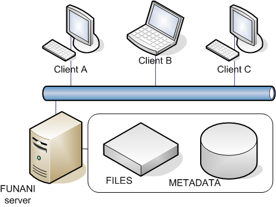

# Global architecture

## Client/Server

The overall architecture is client/server based. Several clients can access the server at the same time. The server is holding the data to be served. This content is the raw data that was uploaded (the files) and metadata related to it (in the database). This separation is needed to allow a good reading performance of the data and fast searches by using database queries. 

The solution is built so that very large amounts of files can be handled - in the order of several millions of files - without requiring large amounts of resources. Of course the access to that huge amount of data is not possible all at once, therefore queries and search modules allow you to narrow the search quickly to what you are looking.

## Details

We differentiate content and metadata:

* The content is the raw data as it was uploaded. Content is never modified after uploading.
* The metadata can be seen as annotations made on that content. Metadata is modifiable after creation.

The metadata is extensible: modules can extend the attributes stored in the database and allow new features without modifying the core system. Metadata is used to describe anything about the data and relationships.

The server contains the operative modules and low level logic.
The client displays and retrieves the content and interact with the server modules.

To be efficient the content will be stored on disk and the metadata in a database to allow fast queries.

## The different tiers

Core modules in the system are the heart of Funani. They have to manage the vital aspects of the application like managing users, sessions and store or load the data. All this is done at the most abstract level independently of the underlying file types or formats used.

The basic modules already provide more useful advanced functionality. These modules are shared or used by a large amount of other modules, but they are not so important that malfunctioning modules in that layer can corrupt data or generate data loss. All such critical aspects are in the core system layer.

The top layer provides high sophisticated modules used to nicely and interactively display the contents of Funani.
