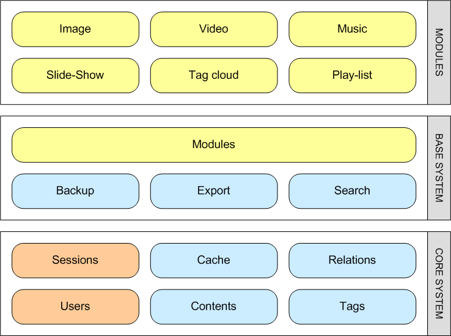

**REWORK NEEDED**

# FUNANI

GOAL: FUNANI is an open source project aiming at solving the management of large image and other media collections in a practical way.

Finding the data you want in big data collections is usually a big pain and consumes a lot of precious time. FUNANI releases you from the tedious job of finding a system to sort the data. Just sort it in many different ways you like. Advanced queries on dates, locations, events or people or more generically categories and tags allow you to narrow the search quickly.

FUNANI can be thought of primarily as a safe. Every file put into the system remains in the system. FUNANI is an additive system. This makes unintended deletion impossible. Of course a maintainance mode can still remove unwanted files forever liberating place. Standard users cannot perform this operation.

FUNANI is also more than a tool. It is also a framework designed for extensibility. When new features are requested they can be implemented by adding new functionality by leaving the existing system alone. Each feature is completely isolated from others as long as they do not depend on them.

## FUNANI

<WRAP center round info 60%>
info box
^ More information ^^
| Pronunciation  | fu'na:ni |
| Origin         | Zulu |
| Meaning        | Search! |
| Imperative plural of -funa (v/i.) ||
</WRAP>

GOAL: FUNANI is an open source project aiming at solving the management of large image and other media collections in a practical way.

**Finding the data you want in big data collections is usually a big pain and consumes a lot of precious time. FUNANI  releases you from the tedious job of finding a system to sort the data. Just sort it in many different ways you like. Advanced queries on dates, locations, events or people or more generically categories and tags allow you to narrow the search quickly.**

FUNANI can be thought of primarily as a safe. Every file put into the system remains in the system. FUNANI is an additive system. This makes unintended deletion impossible. Of course a maintenance mode can still remove unwanted files forever liberating place. Standard users cannot perform this operation.

FUNANI is also more than a tool. It is also a framework designed for extensibility. When new features are requested they can be implemented by adding new functionality by leaving the existing system alone. Each feature is completely isolated from others as long as they do not depend on them.

## Project

### Information

* [[license|license]]: BSD
* [[state|state]]: Currently in design phase, Proof of concept in development
* [[rationale|rationale]]: Why another media management system?
* [[hosting|hosting]]: [LaunchPad](https://launchpad.net/funani)

### Blueprints

The requirements are grouped by functionality resulting in blueprints or specifications. These specifications are the base reference documents for developers while working on their tasks. If the status a the document is still under Drafting, you are invited to contribute!

**List of specifications:**

[[:product:funani:blueprints:start|List of blueprints]] on this site per category

The modular design and small core system allows a good overall stability without sacrificing features. More complex modules build upon the core modules and can maintain relations between contents or tag contents. They also can extend the amount of information about the content or display it in a different way. An "image module" would extend the information about the content by providing information about the file like width, height, color depth, date when the picture was taken, location, ... It then can provide thumbnails to ease previewing of the data and faster browsing (by also using the cache core module). The greatest amount of testing and precautions can be spent on the core level. The stability and integrity of that layer is the most important to ensure.

## Help needed

**Funani needs your feedback or active help!**

Such a wide project needs a lot of helping hands to be driven to completion rapidly.

* Create a nicer logo/mascot 192x192, 64x64, 14x14 
* Define/Discuss the requirements
* Translators
* Testers
* Web developer for the server side (Django Python)
* Contributing developers for plug-ins (Django Python)

If you would like to contribute contact us (See the [[:impressum|Impressum / Legal notice]])

=====  Documentation  =====

====  Architecture  ====

The high level design of the system that helps to organize the development of loosely connected components.

* [Architecture](./architecture)

====  Implementation  ====

[[Development|process]]

[[Technology|selection]]
